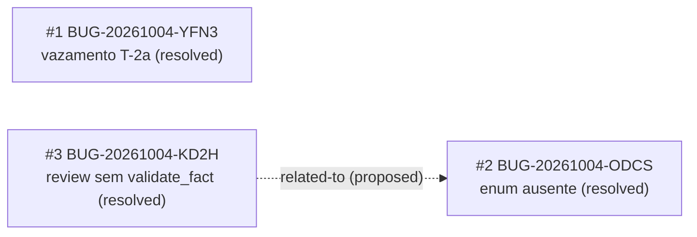

<!-- GENERATED, DO NOT EDIT: regenerado por /reversa-debugger-graph em 2026-10-04T11:45:00-03:00 a partir de 3 bugs -->

# Grafo de bugs — contexto `policy-analysis`

## Grafo (mermaid)

## Clusters

Os 3 bugs convergiram em `src/modules/policy_analysis` e no mesmo padrão estrutural: a feature
dev2-003 registrou execuções como feitas antes de estarem no código (sanitização T-2a
declarada, regra de enum declarada, guarda de regra na correção declarada). Os três estão
corrigidos e travados; o padrão de "registro de execução otimista" ficou documentado em
`_reversa_forward/dev2-003-p0-analise-experiencia/registro-correcoes-20261004.md`.

## Impact score (apenas arestas supported/confirmed)

Nenhum bug aberto: sem scores a calcular. Nota: heurística de triagem
(causados*3 + bloqueados*2 + regressões*4 + relacionados*1, peso de `related-to` limitado a 3),
não substitui `priority`/`severity`.